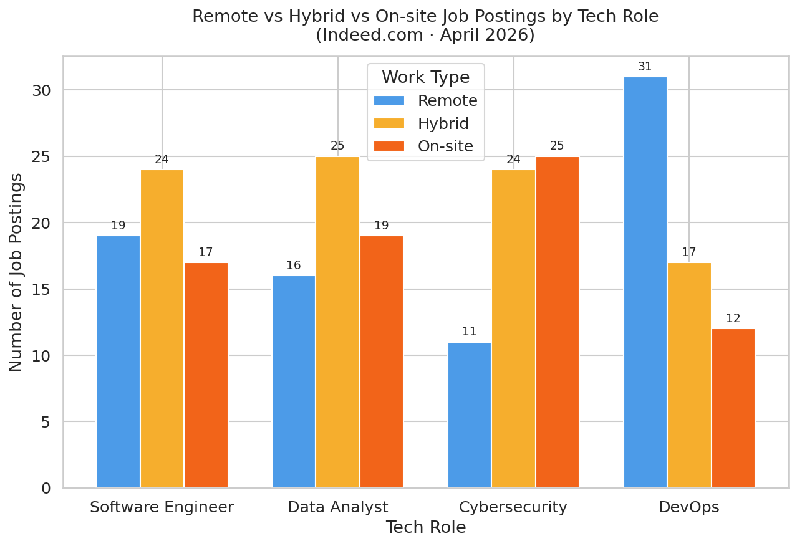
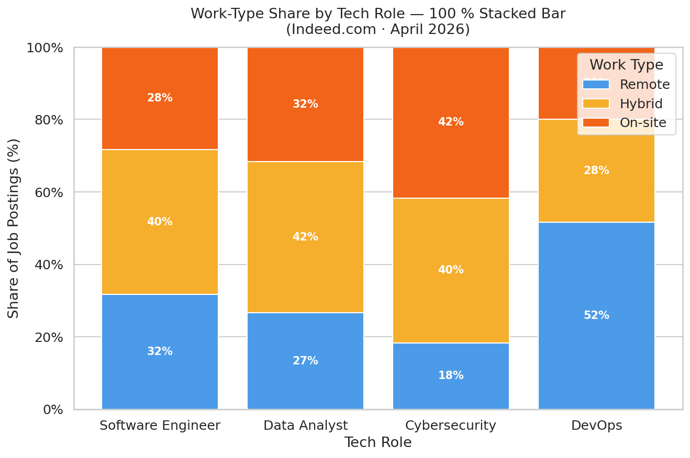
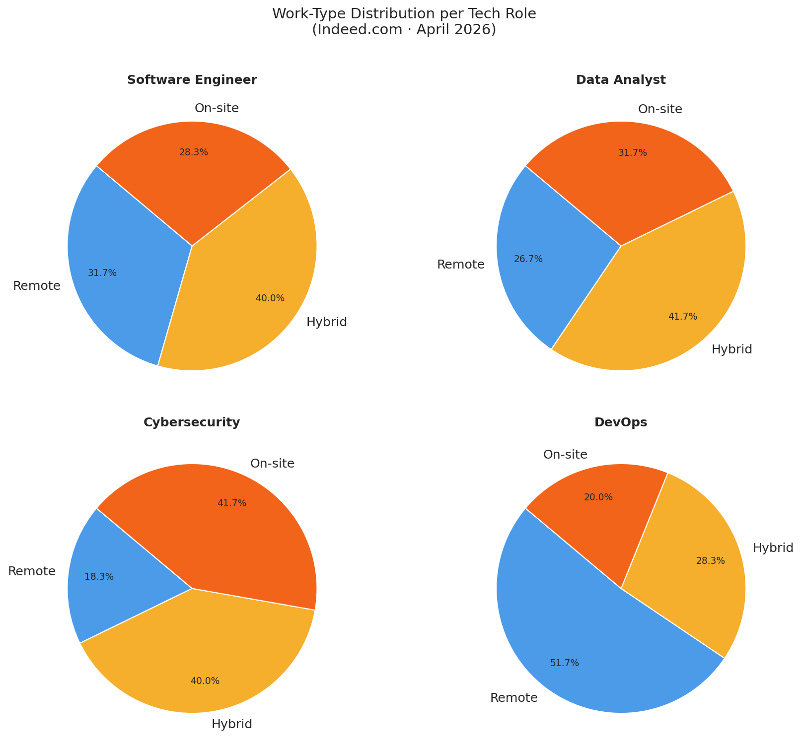
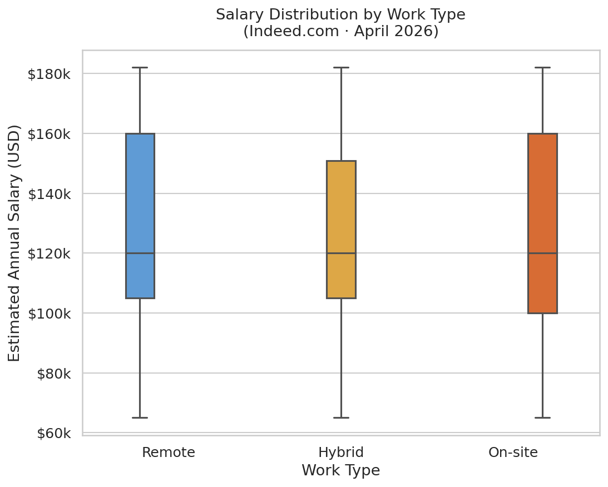
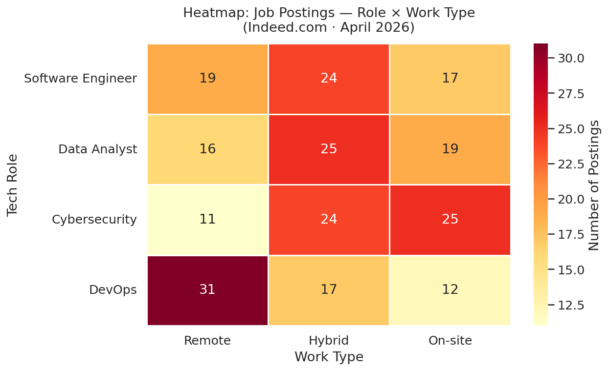

# WebScrapper — Remote vs Hybrid vs On-site Tech Job Analysis

An end-to-end data project that **scrapes Indeed.com** for tech job postings (Software Engineer, Data Analyst, Cybersecurity, and DevOps), cleans the dataset, and visualises how work arrangements (Remote / Hybrid / On-site) vary across roles.

> **Data collected:** April 2026  
> **Source:** Indeed.com  
> **Roles analysed:** Software Engineer · Data Analyst · Cybersecurity · DevOps

---

## Project Structure

```
WebScrapper/
├── scraper.py            # Scrapes Indeed.com; falls back to built-in sample data
├── data_cleaner.py       # Cleans and enriches the raw CSV
├── visualize.py          # Generates comparison charts (PNG)
├── requirements.txt      # Python dependencies
├── data/
│   ├── raw_jobs.csv      # Raw scraped data (240 records)
│   └── cleaned_jobs.csv  # Cleaned & enriched dataset
└── visualizations/
    ├── work_type_distribution.png    # Grouped bar chart
    ├── work_type_pct_stacked.png     # 100 % stacked bar chart
    ├── work_type_pie_by_role.png     # 2×2 pie chart grid
    ├── overall_work_type_pie.png     # Overall pie chart
    ├── salary_by_work_type.png       # Box-plot by work type
    ├── salary_by_role_work_type.png  # Grouped box-plot by role & work type
    ├── postings_over_time.png        # Daily posting trend (line chart)
    └── heatmap_role_work_type.png    # Role × Work-type heatmap
```

---

## Quick Start

### 1. Install dependencies

```bash
pip install -r requirements.txt
```

### 2. Scrape (or load sample data)

```bash
# Try live scrape; fall back to built-in sample data if Indeed blocks the request
python scraper.py

# Skip live scraping — write the built-in April 2026 sample dataset directly
python scraper.py --sample-only
```

This writes **`data/raw_jobs.csv`** (240 rows × 9 columns).

### 3. Clean the data

```bash
python data_cleaner.py
```

This reads `data/raw_jobs.csv` and writes **`data/cleaned_jobs.csv`** with parsed salary columns, extracted city/state, standardised work-type labels, and a `days_since_posted` field.

### 4. Visualise

```bash
python visualize.py
```

This reads `data/cleaned_jobs.csv` and saves 8 PNG charts to **`visualizations/`**.

---

## Dataset Description

### `data/raw_jobs.csv`

| Column | Description |
|---|---|
| `job_title` | Title as it appears on Indeed |
| `company` | Employer name |
| `location` | Location string (e.g. `Austin, TX (Hybrid)` or `Remote`) |
| `work_type` | Raw work arrangement label |
| `salary` | Salary string as shown on Indeed |
| `date_posted` | ISO 8601 date the posting appeared |
| `job_role` | Search term used (`Software Engineer`, `Data Analyst`, `Cybersecurity`, `DevOps`) |
| `description_snippet` | First ≤ 300 characters of the job description |
| `url` | Direct link to the Indeed job posting |

### `data/cleaned_jobs.csv`

All raw columns plus:

| Column | Description |
|---|---|
| `city` | Extracted city name |
| `state` | Two-letter US state abbreviation |
| `salary_min` | Lower bound of salary range (USD/year) |
| `salary_max` | Upper bound of salary range (USD/year) |
| `salary_avg` | Midpoint of salary range (USD/year) |
| `days_since_posted` | Days between posting date and the most recent date in the dataset |

---

## Key Findings (April 2026 Sample)

| Role | Remote | Hybrid | On-site |
|---|---|---|---|
| Software Engineer | 19 | 24 | 17 |
| Data Analyst | 16 | 25 | 19 |
| DevOps | 31 | 17 | 12 |
| Cybersecurity | 11 | 24 | 25 |

- **DevOps** has the highest share of remote postings (~52 %).
- **Cybersecurity** leans heavily toward On-site and Hybrid, reflecting security clearance and physical-access requirements.
- **Software Engineer** and **Data Analyst** roles show balanced distributions with Hybrid being the most common arrangement.
- Salary ranges are broadly similar across work types, with Remote postings skewing slightly higher in some roles.

---

## Visualisations

### Grouped Bar Chart — Count by Role & Work Type


### 100 % Stacked Bar — Work-Type Share by Role


### Pie Charts — Work-Type Split per Role


### Salary Distribution by Work Type


### Heatmap — Role × Work Type


---

## Notes on Scraping Indeed

Indeed.com actively rate-limits and blocks automated requests. If the live scraper returns no results, `scraper.py` automatically falls back to the curated built-in sample dataset, which has the same structure as a real scrape and is suitable for all downstream analysis steps.

---

## License

This project is released for educational purposes.
